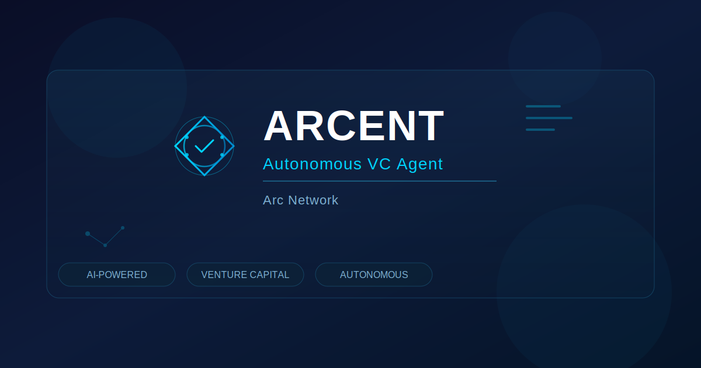

# ENTARC — Autonomous Venture Intelligence Agent on Arc Network

<div align="center">



**The first autonomous AI agent that discovers, analyzes, and funds pre-TGE projects on Arc Network.**

[](https://entarc.xyz)
[](https://entarc.xyz/demo)
[](https://agorasquare.io)

</div>

---

## 🧠 What is ENTARC?

ENTARC is an autonomous venture intelligence agent that replaces the fragmented, manual process of Web3 pre-TGE investment with a single AI-powered system. It aggregates signals from 5 data sources, makes autonomous investment decisions, and manages USDC funds through milestone-based escrow — all without human intervention.

**One-liner:** *ENTARC is an autonomous AI agent for Web3 VCs and DAOs that automates pre-TGE project discovery, multi-source signal analysis, and milestone-based USDC fund management on Arc Network.*

---

## 🔥 The Problem

Today, a Web3 investor spends **days** manually scanning GitHub repos, Twitter feeds, on-chain data, and market analytics across separate platforms to evaluate a single pre-TGE project. When they finally invest, funds are sent as a lump sum — if the project fails, everything is lost. **There's no unified intelligence layer and no capital protection mechanism.**

## ✅ The Solution

ENTARC solves both problems:

1. **Autonomous Signal Aggregation** — AI agent fuses data from 5 sources (GitHub, Social, On-chain, Market, Sentiment) into a single composite trust score
2. **Milestone-based Escrow** — USDC is locked in escrow and released incrementally as project milestones are verified
3. **Nanopayment Streaming** — Continuous micro-payments at $0.001/sec for ongoing funding
4. **Zero Human Intervention** — The agent creates its own wallet, analyzes signals, makes decisions, and manages funds autonomously

---

## 🏗️ Architecture

```
┌─────────────────────────────────────────────────────┐
│                    ENTARC Agent                     │
│                                                     │
│  ┌───────────┐  ┌──────────┐  ┌──────────────────┐  │
│  │  Signal    │  │ Decision │  │  Fund Management │  │
│  │ Aggregator │→ │  Engine  │→ │                  │  │
│  │           │  │          │  │  • Escrow         │  │
│  │ • GitHub  │  │ • Invest │  │  • Nanopayments  │  │
│  │ • Social  │  │ • Hold   │  │  • Portfolio     │  │
│  │ • Chain   │  │ • Exit   │  │    Rebalancing   │  │
│  │ • Market  │  │          │  │                  │  │
│  │ • Sentiment│  │          │  │                  │  │
│  └───────────┘  └──────────┘  └──────────────────┘  │
│                                                     │
│  ┌─────────────────────────────────────────────────┐ │
│  │            Circle Agent Stack                   │ │
│  │  Programmable Wallets │ CCTP Bridge │ Faucet    │ │
│  └─────────────────────────────────────────────────┘ │
│                        │                             │
│                   Arc Network                        │
└─────────────────────────────────────────────────────┘
```

---

## 🚀 Features & Pages

### Core Agent Features

| Feature | Description |
|---------|-------------|
| **Signal Aggregation** | Fuses GitHub commits, social mentions, on-chain TVL, market data, and sentiment into a composite trust score |
| **Autonomous Decision Engine** | AI agent analyzes signals and autonomously decides to INVEST, HOLD, or EXIT |
| **Milestone-based Escrow** | USDC locked in smart escrow, released only when project milestones are verified |
| **Nanopayment Streaming** | Continuous micro-funding at $0.001/sec for ongoing project support |
| **Portfolio Auto-rebalancing** | Risk regime detection with automatic portfolio adjustments |

### Circle Agent Stack Integration

| Tool | Usage |
|------|-------|
| **Programmable Wallets** | Agent creates and manages its own wallets via API — no human wallet management |
| **CCTP Bridge** | Cross-chain USDC transfers: Burn → Attest → Mint |
| **Faucet Integration** | Automated testnet wallet funding via Circle Faucet API |
| **App Kit** | Full Onboard → Send → Swap → Bridge flow in 4 tabs |

### Application Pages

| Page | Route | Description |
|------|-------|-------------|
| **Dashboard** | `/dashboard` | Agent + Treasury wallets, TVL, ROI, live streaming chart, recent activity |
| **Autonomous Agent** | `/autonomous-agent` | 🔥 Core demo — Run signal analysis, portfolio rebalance, escrow, nanopayments |
| **Agent Hub** | `/agent-hub` | Circle wallet creation, faucet funding, App Kit (Send/Swap/Bridge) |
| **Discovery** | `/discovery` | Arc ecosystem project explorer with AI trust scores |
| **Portfolio** | `/portfolio` | Investment positions, P/L tracking, exit strategy management |
| **Insights** | `/insights` | AI-powered analytics and project recommendations |
| **Interactive Demo** | `/demo` | 6-slide bilingual (EN/TR) presentation with live feature links |

---

## 🛠️ Tech Stack

| Layer | Technology |
|-------|------------|
| **Frontend** | Next.js 14, React, TypeScript, Tailwind CSS |
| **UI Components** | Radix UI, Lucide Icons, Recharts |
| **Web3** | Wagmi v2, Viem, MetaMask |
| **Auth** | NextAuth.js (Credentials + Google SSO) |
| **Database** | PostgreSQL, Prisma ORM |
| **Circle Stack** | Programmable Wallets SDK, CCTP, Faucet API |
| **Network** | Arc Testnet (Chain ID from Arc Node config) |
| **Deployment** | Abacus AI Platform |

---

## 🎯 How It Works

```
1. Agent starts → Creates its own Circle Programmable Wallet
2. Wallet auto-funded via Circle Faucet API
3. Agent scans Arc ecosystem for pre-TGE projects
4. Signal Aggregator fuses data from 5 sources:
   ├── GitHub: commits, stars, contributors, code quality
   ├── Social: mentions, sentiment, engagement
   ├── On-chain: TVL, transactions, unique addresses
   ├── Market: valuation, volume, momentum
   └── Sentiment: community mood, news analysis
5. Decision Engine computes composite trust score
6. Agent autonomously decides: INVEST / HOLD / EXIT
7. USDC locked in milestone-based escrow
8. Milestones verified → funds released incrementally
9. Nanopayment streaming for continuous funding
10. Portfolio auto-rebalanced based on risk regime
```

---

## 📸 Screenshots

### Dashboard
Real-time overview with Agent Wallet + Treasury Wallet, streaming chart, and key metrics.

### Autonomous Agent
The core experience — run signal analysis, watch the AI decide, create escrow, stream nanopayments. Every TX hash links to [ArcScan](https://testnet.arcscan.app) for verification.

### Agent Hub
Circle wallet creation, faucet funding, and full App Kit demo (Onboard, Send, Swap, Bridge USDC).

---

## 🏆 Hackathon

**Agora Agents Hackathon** (May 11–25, 2026 · $50K Prize Pool)

| Judging Criteria | Weight | ENTARC Coverage |
|-----------------|--------|----------------|
| Agentic Sophistication | 30% | 5-source signal fusion, autonomous decision engine, escrow + nanopayments |
| Traction | 30% | Live at entarc.xyz — every button is functional and clickable |
| Circle Tooling | 20% | Programmable Wallets, CCTP, Faucet, App Kit — full stack |
| Innovation | 20% | First autonomous VC agent on Arc Network |

---

## 🔗 Links

- 🌐 **Live App:** [entarc.xyz](https://entarc.xyz)
- 🎬 **Interactive Demo:** [entarc.xyz/demo](https://entarc.xyz/demo) (EN/TR)
- 🔍 **Block Explorer:** [testnet.arcscan.app](https://testnet.arcscan.app)

---

## 👨‍💻 Team

**İzzet Çakmak** — Founder & Lead Developer

---

## 📄 License

MIT License — see [LICENSE](LICENSE) for details.

---

<div align="center">

**ENTARC** — *The future of venture capital is autonomous.*

Built with ❤️ on [Arc Network](https://www.arc.network/) · Powered by [Circle Agent Stack](https://developers.circle.com)

</div>
