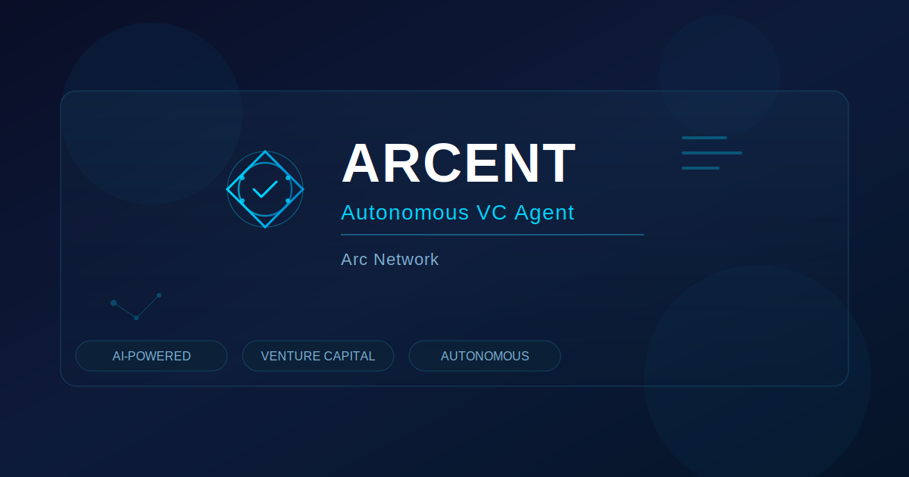
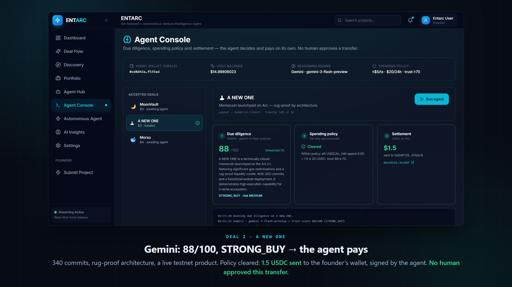
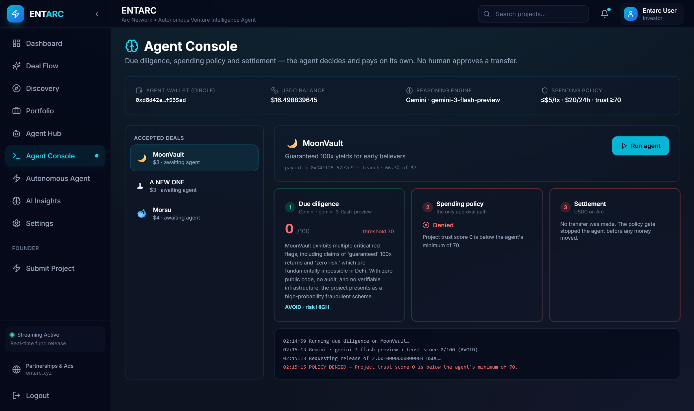
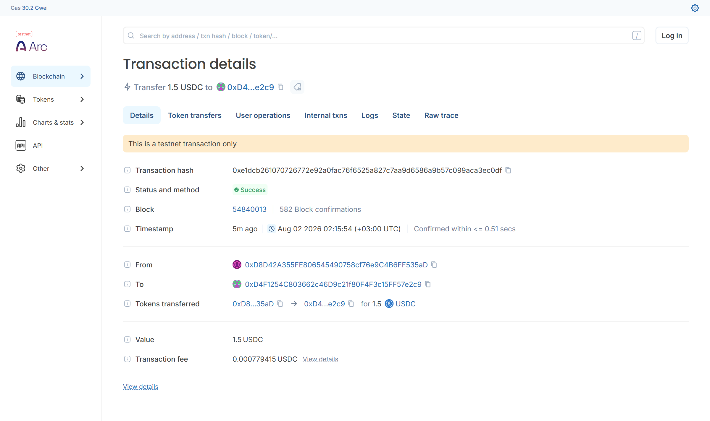

# ENTARC — Autonomous Venture Intelligence Agent on Arc Network

<div align="center">



**The first autonomous AI agent that discovers, analyzes, and funds pre-TGE projects on Arc Network.**

[](https://entarc.xyz)
[](https://youtu.be/J1k3T85fZ-k)
[](https://community.arc.io/public/events/hackathon-programmable-money-74llz8htis)

</div>

---

## 🧠 What is ENTARC?

**ENTARC is the AI VC that writes its own checks.** It runs due diligence with Gemini, then moves real USDC from its own Circle wallet on Arc — with no human in the approval path. A spending policy in code is the only thing that can authorise or block a transfer.

**One-liner:** *An autonomous venture agent that evaluates startups with Gemini and invests real USDC through Circle agent wallets, within hard policy limits, no human in the loop.*

### The decision chain

```
Gemini due diligence  →  spending-policy gate  →  Circle transfer on Arc  →  DB write-back
   trust score 0-100      ≤$5/tx · $20/24h        real USDC, real hash       proposal FUNDED
                          · trust ≥ 70                                       milestone RELEASED
```

Watch it: [**1m45s demo video**](https://youtu.be/J1k3T85fZ-k) — one deal is denied by the policy gate, one is funded on-chain. Both runs are real.

---

## 🔬 Proof — real autonomous payments

Every transfer below was initiated by the agent after its own Gemini verdict. No human clicked "pay".

| What | Value |
|---|---|
| Agent wallet (Circle, developer-controlled) | [`0xd8d42a355fe806545490758cf76e9c4b6ff535ad`](https://testnet.arcscan.app/address/0xd8d42a355fe806545490758cf76e9c4b6ff535ad) |
| Network | Arc Testnet (USDC is the native gas token) |
| Reasoning engine | Gemini 3 Flash, temperature 0 |
| Tranche 1 — *A NEW ONE*, milestone 1 | [1.5 USDC](https://testnet.arcscan.app/tx/0xe1dcb261070726772e92a0fac76f6525a827c7aa9d6586a9b57c099aca3ec0df) · confirmed in 0.51s · fee $0.0008 |
| Tranche 2 — *A NEW ONE*, milestone 2 | [0.9 USDC](https://testnet.arcscan.app/tx/0x990ed73e3ee634c6ac8ad2c44ce5e802bed8006cc861db1cfdb89282b4166389) |
| Denied deal — *MoonVault* | Gemini scored it **0/100** ("high-probability fraudulent scheme") → policy denied the release, **no transaction was created** |

The denial matters as much as the payment: the guardrails are enforced in code ([`lib/agent-policy.ts`](nextjs_space/lib/agent-policy.ts)), not described in a pitch.

---

## 🔥 The Problem

Today, a Web3 investor spends **days** manually scanning GitHub repos, Twitter feeds, on-chain data, and market analytics across separate platforms to evaluate a single pre-TGE project. When they finally invest, funds are sent as a lump sum — if the project fails, everything is lost. **There's no unified intelligence layer and no capital protection mechanism.**

## ✅ The Solution

ENTARC solves both problems:

1. **Autonomous Signal Aggregation** — AI agent fuses data from 5 sources (GitHub, Social, On-chain, Market, Sentiment) into a single composite trust score
2. **Milestone-based Escrow** — USDC is locked in escrow and released incrementally as project milestones are verified
3. **Nanopayment Streaming** — Continuous micro-payments at $0.001/sec for ongoing funding
4. **Zero Human Intervention** — The agent creates its own wallet, analyzes signals, makes decisions, and manages funds autonomously

---

## 🏗️ Architecture

```
┌─────────────────────────────────────────────────────┐
│                    ENTARC Agent                     │
│                                                     │
│  ┌───────────┐  ┌──────────┐  ┌──────────────────┐  │
│  │  Signal    │  │ Decision │  │  Fund Management │  │
│  │ Aggregator │→ │  Engine  │→ │                  │  │
│  │           │  │          │  │  • Escrow         │  │
│  │ • GitHub  │  │ • Invest │  │  • Nanopayments  │  │
│  │ • Social  │  │ • Hold   │  │  • Portfolio     │  │
│  │ • Chain   │  │ • Exit   │  │    Rebalancing   │  │
│  │ • Market  │  │          │  │                  │  │
│  │ • Sentiment│  │          │  │                  │  │
│  └───────────┘  └──────────┘  └──────────────────┘  │
│                                                     │
│  ┌─────────────────────────────────────────────────┐ │
│  │            Circle Agent Stack                   │ │
│  │  Programmable Wallets │ CCTP Bridge │ Faucet    │ │
│  └─────────────────────────────────────────────────┘ │
│                        │                             │
│                   Arc Network                        │
└─────────────────────────────────────────────────────┘
```

---

## 🚀 Features & Pages

### Core Agent Features

| Feature | Status | Description |
|---------|--------|-------------|
| **Gemini due diligence** | ✅ live | Scores a deal 0–100 from repo activity, milestones and category. Runs at temperature 0 — the same evidence must yield the same score when that score releases money. |
| **Spending-policy gate** | ✅ live | Per-transaction cap, rolling 24h budget and a minimum trust score. The agent has no override and no human-approval branch; this gate *is* the approval path. |
| **Autonomous USDC settlement** | ✅ live | Real Circle transactions from the agent's own wallet on Arc, with deterministic idempotency so a retry can never double-spend. |
| **Milestone tranches** | ✅ live | Funding is released per milestone; each release writes its hash back to the deal (`FUNDED` / `RELEASED`). |
| **Risk pause** | ✅ live | The risk monitor flips a flag the policy gate enforces — after that, releases are denied in code. |
| **Signal aggregation** | 🟡 heuristic | GitHub / social / on-chain / market / sentiment weights feed a composite score used for monitoring, not yet for the payment decision. |
| **Nanopayment streaming** | 🔜 roadmap | Sub-cent continuous funding via Circle nanopayments. The current streaming view is a simulation and is labelled as such. |

### Circle Agent Stack Integration

| Tool | Usage |
|------|-------|
| **Programmable Wallets** | Agent creates and manages its own wallets via API — no human wallet management |
| **CCTP Bridge** | Cross-chain USDC transfers: Burn → Attest → Mint |
| **Faucet Integration** | Automated testnet wallet funding via Circle Faucet API |
| **App Kit** | Full Onboard → Send → Swap → Bridge flow in 4 tabs |

### Application Pages

| Page | Route | Description |
|------|-------|-------------|
| **Agent Console** | `/agent-console` | 🔥 **The prize flow** — pick a deal, press *Run agent*: Gemini scores it, the policy gate rules on it, and a real USDC transfer settles on Arc with a live explorer link |
| **Dashboard** | `/dashboard` | Agent + Treasury wallets, TVL, ROI, live streaming chart, recent activity |
| **Autonomous Agent** | `/autonomous-agent` | Signal analysis and portfolio rebalancing views (heuristic engine) |
| **Agent Hub** | `/agent-hub` | Circle wallet creation, faucet funding, App Kit (Send/Swap/Bridge) |
| **Discovery** | `/discovery` | Arc ecosystem project explorer with AI trust scores |
| **Portfolio** | `/portfolio` | Investment positions, P/L tracking, exit strategy management |
| **Insights** | `/insights` | AI-powered analytics and project recommendations |
| **Interactive Demo** | `/demo` | 6-slide bilingual (EN/TR) presentation with live feature links |

---

## 🛠️ Tech Stack

| Layer | Technology |
|-------|------------|
| **Frontend** | Next.js 14, React, TypeScript, Tailwind CSS |
| **UI Components** | Radix UI, Lucide Icons, Recharts |
| **Reasoning** | Google Gemini 3 Flash (`generativelanguage` API, JSON-forced, temperature 0) |
| **Payments** | Circle Developer-Controlled Wallets — `createTransaction` + tx polling |
| **Web3** | Wagmi v2, Viem, MetaMask |
| **Auth** | NextAuth.js (Credentials + Google SSO) |
| **Database** | PostgreSQL, Prisma ORM |
| **Circle Stack** | Developer-Controlled Wallets SDK, Faucet API, CCTP |
| **Network** | Arc Testnet · chain 5042002 · USDC is the native token |
| **Deployment** | Abacus AI Platform |

---

## 🎯 How It Works

```
1. Agent provisions its own Circle wallet on ARC-TESTNET (idempotent)
2. Wallet is funded via the Circle Faucet API
3. A deal reaches ACCEPTED — the agent takes it from there
4. Gemini due diligence  → trust score 0-100 + written rationale, persisted
5. Spending-policy gate  → per-tx cap · 24h budget · trust threshold · pause flag
       denied  → 403, no transaction is ever created
       cleared → continue
6. Circle createTransaction → USDC leaves the agent wallet
7. Poll until the on-chain hash lands, then write back:
       proposal FUNDED · escrowTxHash stored · milestone RELEASED · funding incremented
8. Next milestone repeats 4-7 with its own tranche and its own hash
```

Money moves in exactly one place — [`app/api/agent/escrow/route.ts`](nextjs_space/app/api/agent/escrow/route.ts) — and every path into it passes `checkAgentPolicy()` first.

---

## ▶️ Run it yourself

```bash
cd nextjs_space
cp .env.example .env      # fill in the keys below
npm install --legacy-peer-deps
npx prisma db push && npx prisma db seed
npx tsx --require dotenv/config scripts/agent-e2e-prep.ts   # wallet + faucet + demo deals
npm run dev                                                  # → /agent-console
```

| Variable | Where to get it |
|---|---|
| `GOOGLE_API_KEY` | [aistudio.google.com/apikey](https://aistudio.google.com/apikey) — the agent's reasoning engine |
| `CIRCLE_API_KEY`, `CIRCLE_ENTITY_SECRET` | [console.circle.com](https://console.circle.com) — developer-controlled wallets |
| `DATABASE_URL`, `NEXTAUTH_SECRET`, `NEXTAUTH_URL` | any PostgreSQL instance + a random secret |
| `AGENT_MAX_PER_TX_USDC`, `AGENT_DAILY_CAP_USDC`, `AGENT_MIN_TRUST_SCORE` | the agent's guardrails (defaults: 5 / 20 / 70) |

Handy scripts: `scripts/check-proof.ts` prints every funded deal with its hash · `scripts/reset-all-demo.ts` rewinds the fixtures for a clean run.

---

## 📸 Screenshots

### Agent Console — the deal that got funded

Gemini scores *A NEW ONE* 88/100, the policy gate clears it, and 1.5 USDC settles on Arc — the hash links straight to ArcScan.

### Agent Console — the deal that got denied

*MoonVault* ("guaranteed 100x, no public code") scores 0/100. The release is denied and no transaction is created.

### On-chain proof

1.5 USDC, confirmed in 0.51 seconds, fee $0.0008 — from the agent wallet to the founder.

---

## 🏆 Competitions

### Circle Agentic Economy Prize ($50K) — Build with Gemini XPRIZE

| Prize requirement | How ENTARC meets it |
|---|---|
| Real agent-driven transactions | Two on-chain USDC transfers, hashes in [Proof](#-proof--real-autonomous-payments) |
| The agent pays on its own, within set rules | `checkAgentPolicy()` is the only approval path — no human branch, no override flag |
| A human manually completing checkout does not qualify | There is no checkout: the API call that moves money is the agent's own step |
| Payments are central to the business | The product *is* automated investment — remove payments and nothing is left |
| Runs live, or on testnet with a clear path to production | Live on Arc Testnet at [entarc.xyz](https://entarc.xyz); mainnet is a config change |
| Public GitHub repo | This repository |
| Agent's Circle wallet + block-explorer proof | [`0xd8d4…35ad`](https://testnet.arcscan.app/address/0xd8d42a355fe806545490758cf76e9c4b6ff535ad) |
| Built with Gemini (main competition) | Gemini 3 Flash is the due-diligence engine ([`lib/gemini.ts`](nextjs_space/lib/gemini.ts)) |

### Programmable Money Hackathon · Build on Arc

Agentic Track (Final Submission: August 9, 2026 · Demo Day: August 20, 2026)

| Final Requirement | ENTARC Coverage |
|-------------------|-----------------|
| Working MVP on Arc | Live at [entarc.xyz](https://entarc.xyz) — Circle Developer-Controlled Wallets + Faucet on ARC-TESTNET |
| Public repo | [github.com/izzetcakmak/ENTARC](https://github.com/izzetcakmak/ENTARC) |
| 3-minute video | Voiced product walkthrough — signal engine, escrow, nanopayment streaming |
| Presentation deck | Full pitch deck — Wallets + Faucet live today; escrow, streaming & CCTP shipping by Demo Day |

Top teams earn a place in an 8-week accelerator programme.

---

## 🔗 Links

- 🌐 **Live App:** [entarc.xyz](https://entarc.xyz) — the prize flow lives at `/agent-console`
- 🎬 **Demo video:** [youtu.be/J1k3T85fZ-k](https://youtu.be/J1k3T85fZ-k) (1m45s, narrated)
- 🔗 **Agent wallet:** [`0xd8d4…35ad`](https://testnet.arcscan.app/address/0xd8d42a355fe806545490758cf76e9c4b6ff535ad) on Arc Testnet
- 🎬 **Interactive Demo:** [entarc.xyz/demo](https://entarc.xyz/demo) (EN/TR)
- 🔍 **Block Explorer:** [testnet.arcscan.app](https://testnet.arcscan.app)

---

## 👨‍💻 Team

**İzzet Çakmak** — Founder & Lead Developer

---

## 📄 License

MIT License — see [LICENSE](LICENSE) for details.

---

<div align="center">

**ENTARC** — *The future of venture capital is autonomous.*

Built with ❤️ on [Arc Network](https://arc.io) · Powered by [Circle Agent Stack](https://developers.circle.com)

</div>
